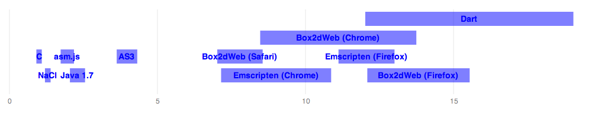
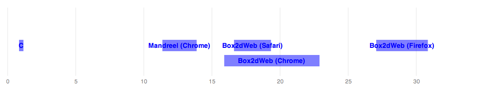

It's been over a year since I first [addressed][1] the question of [Box2D][2]
performance on various VMs and compilers, and I've been meaning to revisit it
for some time. This time, I'm concerned primarily with the performance of
virtual machines, as this is where we've seen most interesting developments of
late.

Since I ran the original benchmarks, I and others have added tests for the
ActionScript 3 VM used in Flash, as well as the nascent Dart VM. Also, the VM
team at Mozilla have released early versions of [asm.js][3], and improved the
output of [Emscripten][4] (which is the one compiler I'm including in the mix,
because its output constitutes something close to a fundamentally different VM
than standard Javascript).

I'll start with raw numbers, since everyone seems to want those first.
Afterwards, I'll follow up with a bit more detail and some observations. All
of these tests were performed on my MacBook Pro with a 2.5 GHz i7. There does
not seem to be significant variance across runs, and I don't believe the
ratios will differ significantly on other modern Intel platforms (I'd like to
get numbers for mobile ARM devices, which I suspect will behave differently,
but that's much more involved).

So without further ado, here are the raw numbers. The units are `ms/frame`,
followed by standard deviation and ratio compared to raw C.

  <table>
    <tr><td>C (gcc 4.2.1)</td><td>2.62 +/- 0.24</td><td>1.0x</td></tr>
    <tr><td>NaCl (x86-32)</td><td>3.39 +/- 0.25</td><td>1.3x</td></tr>
    <tr><td>asm.js (Firefox Nightly)</td><td>5.12 +/- 0.59</td><td>1.9x</td></tr>
    <tr><td>Java 1.7</td><td>6.02 +/- 0.67</td><td>2.3x</td></tr>
    <tr><td>AS3 (Flash 11.6)</td><td>10.4 +/- 0.91</td><td>4.0x</td></tr>
    <tr><td>Box2dWeb (Safari)</td><td>20.4 +/- 2.01</td><td>7.8x</td></tr>
    <tr><td>Emscripten (Chrome)</td><td>23.6 +/- 4.87</td><td>9.0x</td></tr>
    <tr><td>Box2dWeb (Chrome)</td><td>29.1 +/- 6.91</td><td>11x</td></tr>
    <tr><td>Emscripten (Firefox)</td><td>31.6 +/- 2.48</td><td>12x</td></tr>
    <tr><td>Box2dWeb (Firefox)</td><td>36.2 +/- 4.53</td><td>14x</td></tr>
    <tr><td>Dart</td><td>40.7 +/- 9.21</td><td>15x</td></tr>
  </table>

And the following graph shows the performance of each VM, with their
means and standard deviations scaled relative to native:

  

## Observations

### Javascript VM performance has stabilized a bit

When I first ran these benchmarks at the end of 2011, Javascript performance
was all over the map. We saw everything from 12x native performance to over
30x:

  <table>
    <tr><td>C (gcc)</td><td>3.83 +/- 0.62</td><td>1.00x</td></tr>
    <tr><td>Mandreel (Chrome)</td><td>48.33 +/- 4.82</td><td>12.61x</td></tr>
    <tr><td>box2d-web (Safari)</td><td>68.85 +/- 5.20</td><td>17.97x</td></tr>
    <tr><td>box2d-web (Chrome)</td><td>74.30 +/- 13.4</td><td>19.39x</td></tr>
    <tr><td>box2d-web (Firefox8)</td><td>110.9 +/- 7.26</td><td>28.96x</td></tr>
  </table>

  

If you refer back to the new numbers, you'll see that the Javascript VMs have
tightened up to the 8x - 14x range, with lower variance. Even though that's
still around an order-of-magnitude slower than native, it's a significant
improvement. And perhaps as importantly, the fact that these values cluster
around a tighter range means Javascript performance is more reliable than it
was a year ago.

### There are two 'clusters'

When I look at the graph above, the first thing that sticks out is that there
are two obvious performance clusters. If you ignore AS3 for a moment, you'll
notice that there's a cluster right around 1-2x native, and another broadly
centered on 10x native. These clusters correspond to the "static" and
"dynamic" VMs, respectively (I'm aware I'm abusing these terms a bit, but I
believe they capture a fairly fundamental difference between, say, the JVM and
a Javascript VM). You might also notice that the variance in each VM's
performance is closely related to its mean -- in other words, the slower they
are, the more unpredictable they are.

AS3 is something of a special case, being a hybrid VM that will use type
annotations to emit fewer runtime checks where possible, so it at least
broadly makes sense that it would fall somewhere between the two clusters. But
do note that I'm no expert on AS3 internals, and as I mention below this
*may* be attributable at least partially to the use of native vector classes
in the Box2D code.

### AS3 is faster than you think

I was pleasantly surprised by the performance of the ActionScript VM. Coming
in at 4x native performance, it's actually closer to the C/JVM cluster than
the dynamic VMs. The Box2D code is fully type-annotated, which is where I
understand that AS3 shines. And it may be getting a bit of a boost from the
platform's native vector math libraries, but I'm not sure to what extent this
is a factor.

### [p]NaCl and asm.js

This is a really interesting pair of cases. [NaCl][5], for those unfamiliar
with it, is a provably safe sandbox for executing compiled x86 code in the
browser (pNaCl is its not-quite-finished counterpart that ships LLVM bitcode
rather than x86). [asm.js][3] is Mozilla's experimental Javascript variant for
use (typically) as a C compilation target. Both of them achieve impressive
results, with NaCl running about 30% slower than raw gcc output, and asm.js
clocking in at around 2x native. It's still early days for asm.js, so
presumably its output could still be optimized more to get it into the same
ballpark as NaCl.

### Dart

I included Dart numbers because I have them, but please take them with a grain
of salt. The Box2D port is relatively new, and my understanding is that
there's still a lot more optimization work going on in the VM.

## Conclusions

The VM world continues to change rapidly, with Javascript VMs improving and
new entrants such as Dart joining the fray. Meanwhile, we're starting to see
novel approaches to safely running native code in the browser, with NaCl and
asm.js, coming close to parity with native code.

And as always, the code is available on [Github][6] if you want to run it for
yourself or tweak the implementations. What I love about this approach to
benchmarking is that it's perfectly sound to tweak a given implementation to
achieve better results. After all, the only goal is to show that a platform
can compute the task at hand as fast as possible.

[1]: http://j15r.com/blog/2011/12/15/Box2D_as_a_Measure_of_Runtime_Performance
[2]: http://box2d.org/
[3]: http://asmjs.org/
[4]: https://github.com/kripken/emscripten/wiki
[5]: https://developers.google.com/native-client/
[6]: https://github.com/joelgwebber/bench2d
