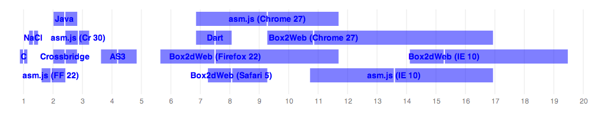
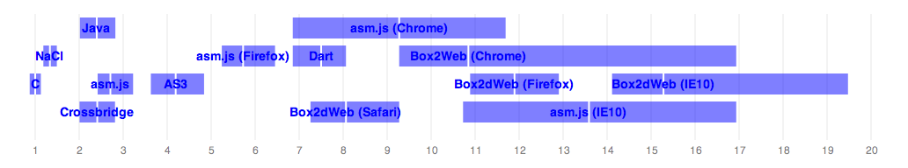

*Update (2013.07.09)*

With some helpful hints from Alon Zakai (see the comments) and others, I was able to
determine that the tip-of-trunk build of [Emscripten][4] produces significantly
better results on Firefox 22 and Chrome 30 (canary), as seen below. Firefox 22
definitely includes asm.js optimized code-generation, and based upon the degree
of improvement (from a mean of 23ms/f to 7ms/f), Chrome 30 must be doing something
similar. Note that Alon is seeing somewhat better results than I am on his desktop machine,
for reasons that we haven't quite teased out, but they're close enough that I
believe we have a fairly accurate representation of reality here.

I find this rather exciting, because it puts asm.js within a stone's throw of NaCl
and raw native code on Firefox, and is within 3x of native on an upcoming Chrome
version. If a clever solution to the "allocate all your heap up front" problem can
be found in asm.js, it might even turn out to be a good solution on mobile, where
it's badly needed.

|                           | ms/frame | 5th %ile | 95th %ile | Ratio to C |
|---------------------------|----------|----------|-----------|------------|
| asm.js (Firefox 22)       | 4.80     |4.0       | 6.0       | 1.94       |
| asm.js (Chrome 30)        | 7.10     |6.0       | 8.0       | 2.86       |

---

I've been meaning to follow up on [this post][1] for a few months now, but as
you can imagine, life has a habit of getting in the way. But I finally have a
bit of spare time this holiday weekend, so I'll try to address a few of the
issues raised by that post.

First, the updated results, as of today:

|                           | ms/frame | 5th %ile | 95th %ile | Ratio to C |
|---------------------------|----------|----------|-----------|------------|
|C (gcc 4.8)                | 2.48     | 2.17     | 2.80      | 1.00       |
|NaCl (x86-32)              | 3.31     | 2.94     | 3.70      | 1.34       |
|Java (1.8)                 | 5.95     | 5.00     | 7.00      | 2.40       |
|Flash/Crossbridge (\*)     | 5.98     | 4.98     | 6.98      | 2.41       |
|asm.js (\*\*)              | 6.72     | 6.00     | 8.00      | 2.71       |
|AS3                        | 10.4     | 9.00     | 12.0      | 4.19       |
|asm.js (Firefox)           | 14.2     | 13.0     | 16.0      | 5.73       |
|Dart                       | 18.6     | 17.0     | 20.0      | 7.50       |
|Box2dWeb (Safari)          | 20.0     | 18.0     | 23.0      | 8.07       |
|asm.js (Chrome)            | 23.0     | 17.0     | 29.0      | 9.27       |
|Box2dWeb (Chrome)          | 26.9     | 23.0     | 42.0      | 10.9       |
|Box2dWeb (Firefox)         | 29.5     | 27.0     | 32.0      | 12.0       |
|asm.js (IE10) (\*\*\*)     | 33.7     | 26.6     | 42.0      | 13.6       |
|Box2dWeb (IE10) (\*\*\*)   | 37.9     | 35.0     | 48.3      | 15.3       |
|asm.js (Safari) (\*\*\*\*) | -        | -        | -         | -          |

[Test platform: MacBook Pro, 2.5 GHz i7, 16G memory, Mac OS X 10.8.4.
 All platform and compiler versions are latest unless otherwise specified.]

(*) Crossbridge has awful clock() resolution, so I just assumed +/- 1ms
percentiles.

(**) Here, 'asm.js' refers to the asm.js output running in Firefox Nightly,
with full optimizations.

(***) I don't have any easy way to run Windows natively on my Mac (I'm not
going to setup dual boot partitions just for this benchmark), so I had to try
and back out IE10 numbers using VirtualBox. I calculated a performance penalty
ratio by running the Javascript benchmarks on Chrome/Mac and Chrome/Win (VM)
(`38.5ms / 26.9ms = 1.43x`), then used that to adjust the IE10 numbers. There
are all sorts of things that could be wrong with this, but I expect it at
least gives us a rough idea.

(****) asm.js unfortunately hung on Safari and never recovered. Hopefully
this will be sorted out at some point.

  

  Scaled to multiples of native performance. The white line denotes the mean,
  and the edges of   the box denote the 5th and 95th %iles.

## Updates

### Statistics and distributions

The first issue is that my statistics didn't make a great deal of sense, as so
helpfully pointed out on Reddit -- I assumed a normal distribution, which is
of course not the case for this performance data. I've fixed the measurements
and graph to show 5th and 95th percentiles instead, which should give a pretty
clear idea of the distribution. Most of the results aren't significantly
different, with the exception that Box2dWeb on V8 in Chrome has a very long
right tail, which I'll discuss below.

### Emscripten and asm.js

My original post wasn't at all clear about Emscripten and asm.js. I believe
I've made it a lot clearer this time 'round. Here and in the code, I now refer
to all Javascript output compiled through Emscripten (with ASM_JS=1) as
"asm.js". I try to be clear in the data which is running with "asm.js
optimizations", and which is running on standard Javascript VMs.

### Crossbridge

I've also added Adobe's Crossbridge (originally Alchemy, then Flascc) as a
target. If you're not familiar with it, this is Adobe's C++ to AS3 bytecode
compiler (via LLVM, very much like Emscripten). The performance is quite good
-- roughly on par with Java and asm.js, which is impressive. One caveat:
Crossbridge's clock() function appears to have a very coarse resolution
(~7.8ms), so while I was able to calculate the mean, I wasn't able to get
valid percentiles.

### Dart

The version of Dart (and its Box2D port) I originally tested against had some
serious performance issues that caused it to run at around half the speed of
many Javascript VMs. Those issues appear to be largely fixed, and now it runs
faster than any Javascript VM, with the exception of the asm.js output on
Firefox (note that I'm referring to Firefox *without* the asm.js code
generation in nightly builds, which is much faster).

### Java

I updated my JVM to 1.8, and ensured that I had the most flattering values
set in jBox2d's Settings.java (someone pointed out last time that I had failed
to enable sin/cos lookup tables). The settings made no noticeable difference,
and updating to Java 1.8 made a modest improvement.

### The Repo

I've reorganized the [repo][2] (especially the /c part) to be a bit less nasty,
and added a README that should give you a reasonable idea of how to build and
run everything.

## A bit more analysis

The overall performance clusters remain largely the same as before. C and NaCl
set the standard, with NaCl exacting the expected 20-30% performance penalty
over raw native binaries.

Next up, we have Java, optimized asm.js, and Crossbridge clustering around
2.5x the runtime of native code. I'm tempted to call this the "specialized VM"
case -- in the sense that they're VMs that implement specialized code
generation for input languages whose semantics are restricted for performance
reasons. That's certainly true of the JVM and the optimized asm.js VM, though
I'm not 100% certain it applies to Crossbridge (i.e., does the standard AS3 VM
just happen to perform well on Crossbridge output, or did they implement
specialized code generation paths that depend upon restricted AS3 semantics?).

Idiomatic Javascript and Dart occupy the entire right half of the
distribution, everywhere from 7x to 12x native performance. Dart has improved
significantly since the last time I checked, probably attributable to *both*
VM and Box2D library improvements, and is now clearly at the head of the
"idiomatic dynamic language" pack. There are also some odd surprises, with V8
exhibiting an extraordinarily long right tail, as far as 17x out. This,
despite the fact that it has respectable mean performance. I don't know what's
causing this, but I would tend to suspect either a bad GC pause, or some
pathological JIT deoptimization. Hopefully those more familiar with the
vagaries of V8 performance can shed some light on this. I'm also pleasantly
surprised that IE10 lives at least generally in the same cluster as the other
browsers -- it's not hard to envision a time when no browser with significant
usage turns in truly terrible Javascript performance.

asm.js on Firefox is an unusual case. Firefox's VM does relatively poorly on
idiomatic Javascript, but does a remarkably good job on asm.js output (note
that this is *without* the asm.js-specific code generation in Firefox nightly).
It's possible they're slowly rolling in changes to optimize for asm.js ouptut
specifically, though I'm not certain if this is the case (or even feasible).

Finally, AS3 turns in the same solid performance as always. I've read that the
Flash AS3 VM can generate fairly tight code for typed source code (though quite
bad code for untyped source), and this would seem to bear that out.

## Conclusions

As always, it's hard to draw absolute conclusions about something as mercurial
as VM performance. But since I've begun these measurements, I've seen what
appear to be *some* stable patterns. The fully dynamic VMs seem to cluster
roughly around an order-of-magnitude slower than native code, and their
variance is quite high. Their performance continues to improve, but it's
starting to feel asymptotic and somewhat chaotic, perhaps as various
optimizations trade off against one another. Dart may well be able to buck
that trend, as the team has specifically restricted the language semantics to
be more amenable to optimization. But it will be quite some time before we
understand where its performance asymptote lies.

I also note that what I referred to earlier as the "specialized VMs" seem to
run quite stably around 2-3x native performance. I doubt the JVM's performance
is going to change significantly in the future. I'm less certain about asm.js
and Crossbridge, because the techniques they use at least *appear* to permit
more options for optimization than are available to the JVM (e.g., they
receive monolothic input, statically optimized from C++, that usually performs
manual memory management). So it seems plausible that they could get within
spitting distance of NaCl's performance.

It also appears to be fairly conclusively proven that even fully dynamic
Javascript VMs can perform better on compiled C++ output than on idiomatic
Javascript. I still find this surprising, even after having it explained in
[great detail][3] by Vyacheslav Egorov. Now to be fair, this is only true if
you accept that dumping your entire heap in a `TypedArray` is "fair play"
(because doing so allows the VM to drop a lot of primitive type checks), but
it's still interesting and useful that this works, and holds for all
Javascript VMs I tested (except Safari, where it crashed).

What interests me most is the relationship between Javascript VMs and the
"other" options that are available for performance-critical code. It is clear
to me that we can't expect Javascript performance to improve to anywhere close
to native performance, and while this may not matter for the vast majority of
code, there are plenty of cases where it matters a *lot*, both for raw
performance (e.g., how long does it take to process a photograph?) and for
energy consumption (e.g., will processing a few photographs on my phone drain
the battery more quickly than it should?). For these cases, I believe the web
needs an alternative virtual machine. It need not be the machine one would use
for the vast majority of code, and it need not even interoperate with
Javascript at anything other than arm's length. This role could be filled by
pNaCl, and possibly by asm.js if its performance improves a bit more. I
sincerely hope that one of these options achieves sufficient penetration that
it becomes possible to build web apps to cover all use-cases, and not just
those that don't require native runtime performance.

## Future Work

- A few people asked me about .NET VM targets. I still haven't done this, as I
don't have a machine handy to run them on. I suspect it will be roughly on par
with the other "specialized VMs".
- Running the benchmarks is still an excruciating process. I'd like to find
standalone command-line versions of everything I need, but that's proving to be
far more trouble than it's worth so far. I welcome any and all patches to
mitigate this issue.
- Somebody asked me for VB benchmarks. I'm still waiting on BOX2D.BAS :)

[1]: http://j15r.com/blog/2013/04/25/Box2d_Revisited
[2]: https://github.com/joelgwebber/bench2d
[3]: http://mrale.ph/blog/2011/11/05/the-trap-of-the-performance-sweet-spot.html
[4]: https://github.com/kripken/emscripten
