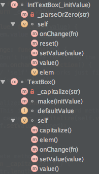

#### *Pre-caveat*

Plenty of people have chimed in to let me know that I'm dumb, *dumb*, **dumb** because this
pattern can be quite inefficient if used on performance-critical (memory or time) code.
Don't do that. As I point out in the introduction, I don't write large programs this way,
because... well, I don't write large programs in raw Javascript, because I'm not a
masochist.

If you *like* writing large amounts of raw Javascript, please don't waste your breath telling
me how much I should love it. I'm not telling you not to do so, just humbly pointing out
that I've done a fair amount of it, and find it quite painful. If it works for you, then by
all means carry on.

---

### *I don't always write raw Javascript, but when I do I use this pattern to make it less painful.*

Love the language, or hate it -- I don't think it's debatable that its
mechanisms for defining abstract data types are a bit... incoherent. This isn't
necessarily anyone's fault; we know that the core of the language was bung out
under duress and time pressure. But what we have to work with is a mishmash of
dictionary types, an unfinished prototype system, a little bit of a Smalltalk/Java
class system, and `this` behavior that not even a mother could love.

When I'm writing large amounts of code to run in the browser, I tend to
approach the problem with higher level tools -- [GWT][1], [JSX][2],
[TypeScript][3], [Dart][4], [Closure][5], and so forth. I personally find that
I need a type checker to manage large projects (especially with a team), and
at certain scales an optimizing compiler becomes indispensible. And for
very simple scripts, simple Javascript with just dictionaries and functions is
perfectly serviceable. But what about those occasions where you either can't
use a compiler (e.g., because you're writing code for someone who doesn't want
to integrate it into their build system), or it's too painful to be worth the
effort (e.g., medium-sized Chrome extensions)?

When I find myself in this situation, I fall back to a pattern that I find
takes a lot of the pain out of raw Javascript. I feel it gives me just the
right set of abstractions to keep the code from turning into a creeping
spaghetti monster, without much boilerplate, and that eliminates a few very
difficult-to-avoid Javascript errors. The following is a simple, contrived
example that should get the rough idea across. You may note that it derives
to a certain extent from what's come to be known as the [Crockford Pattern][10],
though I've extended it a bit.

## A Simple Javascript class

<pre class='brush:js'>
function TextBox() {
  // Public methods.
  var self = {
    elem: function() {
      // Reference private fields directly.
      return _elem;
    },
    value: function() {
      return _elem.value;
    },
    setValue: function(value) {
      _elem.value = value;
    },
    capitalize: function() {
      var capped = _capitalize(self.value());
      self.setValue(capped);  // Reference public methods via 'self'.
    },
    onChange: function(fn) {
      // Don't hate me for using the 'onchange' property. I'm just trying to keep it simple.
      _elem.onchange = function() {
        // 'self' still works just fine.
        fn(self.value());
      }
    },
  };

  // Private fields and methods.
  // Prefix these with _ to avoid conflicts.
  var _elem;

  function _capitalize(str) {
    if (str.length == 0) {
      return str;
    }
    return str.substring(0, 1).toUpperCase() + str.substring(1);
  }

  // Constructor body.
  _elem = document.createElement("input");
  _elem.type = "text";
  self.setValue(TextBox.defaultValue);

  return self;
}

// Class fields and methods.
TextBox.defaultValue = "";

// I could have just made 'initValue' a ctor arg, but I needed an excuse for a class method :)
TextBox.make = function(initValue) {
  var tb = TextBox();
  tb.setValue(initValue);
  return tb;
};

// Using it looks like pretty much like any other Javascript class.
// You don't actually need the 'new', but it doesn't hurt anything either.
var wootBox = new TextBox();
wootBox.setValue("w00t");
document.body.appendChild(wootBox.elem());
</pre>

---

The first thing I notice about this code is that's pretty terse by Javascript standards.

- The `prototype` keyword shows up not once (no `Class.prototype.method = function() { ... }` boilerplate).
- There are no `this` qualifiers on private methods and fields.
- Constructor arguments are automatically promoted to private fields
  (no `function MyClass(thing) { this.thing = thing; }` boilerplate).

But there are other benefits as well. A huge one for me is that we completely avoid the utterly insane
Javascript [`this`][6] behavior. That alone's worth the price of admission for me, given how many times I've
screwed this up in Javascript. Look at the definition of the `onChange()` method -- see how it happily
references an instance method via `self` in the event callback? Say goodbye to god-awful hacks like this:

<pre class='brush:js'>
function method() {
  var that = this;
  elem.onclick = function(e) {
    // MC Hammer says: Can't touch 'this'.
    that.thingWasClicked();
  };
}
</pre>

Then there's the fact that the privates are, well... *private*. I know there are plenty of Javascript
developers out there who like leaving their privates dangling in the breeze, but I'm not one of them.
Now if you *really* want to, you can always make public methods as follows:

<pre class='brush:js'>
function MyClass() {
  var self = {
    openBarnDoor: function() {
      // Public fields have to be self-qualified.
      return self.danglingPrivates;
    }
  };

  self.danglingPrivates = "in the breeze";
}

var mc = new MyClass();
alert(mc.danglingPrivates);
</pre>

But wait, there's more! Anyone ever try this little gem in Javascript? It's a functional-ish language,
after all, so it really seems like it ought to work...

<pre class='brush:js'>
Something.prototype.setValue = function(val) {
  this._value = val;
};

var applicator = something.setValue;  // I do not think this does what you think it does
applicator(42);
</pre>

But of course it doesn't usually work, because `this` doesn't get bound correctly inside `setValue()`,
leading to bizarre outcomes like `window._value == 42`. Or maybe even `_value` set on whatever instance
you happen to be calling from. That's what's so fun about Javascript -- using `this` is kind of like
handing a flamethrower to a four-year-old. You never know what you're going to get, but it's almost
never boring! But a method reference to a class created with this pattern works a charm, because
everything it cares about is bound via closure.

## A Less Simple Javascript Class

So far so good, but what about inheritance? Rather than answering that directly, I'm going
to back up a bit and discuss the actual *goal*, which inheritance is just one way to achieve.
You likely learned in school that the good old Trinity of Object Oriented Programming is
*Encapsulation*, *Inheritance*, and *Polymorphism* (hallowed be their names). But arguably
inheritance has no business being in that set. Encapsulation gives you the ability to hide
the details of a computation. Polymorphism gives you the ability to interact with different
kinds of objects using a uniform API  (among other things). But inheritance is just a way
to share code among different class implementations, and hardly the only one.

So instead of inheritance, I'm going to focus on *composition* to solve the code duplication
problem. The idea is very simple: as long as you can easily delegate to another class'
methods and fields, you can just as easily share its code as if you'd inherited its
implementation.  The following example shows how this works in practice. The goal is to
create an `IntTextBox` that behaves just like a `TextBox`, but that only allows integral
values (Yes, it's a bit contrived, but I'm sure you can figure out how to apply it to
real problems of your own).

<pre class='brush:js'>
function IntTextBox(_initValue) {
  // Composed instances.
  // Defined here so that we can reference its methods directly in 'self' initialization.
  var _box = TextBox();

  var self = {
    // Method that doesn't reference the composed instance.
    reset: function() {
      self.setValue(_initValue);
    },

    // Methods on the delegated instance whose logic we want to override.
    value: function() {
      return _parseOrZero(_box.value());
    },
    setValue: function(value) {
      _box.setValue(_parseOrZero(value));
    },
    onChange: function(fn) {
      // Here we override the behavior of an event callback to exclude spurious changes.
      _box.onChange(function(unused) {
        // 'self' still works just fine.
        var val = self.value();

        // As do references to private fields.
        if (val == _lastValue) {
          return;
        }
        _lastValue = val;
        fn(val);
      });
    },

    // Methods we simply want to delegate to directly.
    elem: _box.elem,

    // Explicitly skip 'capitalize', because it doesn't make any sense for this class.
  };

  function _parseOrZero(str) {
    var value = parseInt(str);
    if (isNaN(value)) {
      return 0;
    }
    return value;
  }

  var _lastValue;

  if (_initValue !== undefined) {
    self.setValue(_initValue);
  }

  return self;
}
</pre>

---

Ok, so this is a bit more work than inheritance, but not much -- you have to enumerate all of the
methods you want to delegate to -- but honestly, it's not that bad to write `method:_delegate.method,`
a few times, is it? I know it might seem a bit weird if you're used to inheritance, but I've been
writing a fair amount of [Go][12] lately, which comes down hard on the side of composition over
inheritence, and I don't miss it at all. And let's look at what it buys you.

For one thing, it gives you the ability to hide methods on the delegatee. This is hugely valuable --
I can't count the number of times I've seen (and at times been responsible for) a bad API stemming
from awkward use of inheritance. The very existence of `java.lang.UnsupportedOperationException`
(which, oddly enough, is actually thrown from some of the core collections classes) is a massive
cautionary tale on this front.

A related benefit is that it gives you the opportunity to
rename methods in the outer class. I'm sure everyone reading this *always* picks nice, beautiful,
unambiguous method names that never conflict with those in a subclass. But I think we all eventually
end up in a case where some clown has named a base class method `get()`, and we end up stuck with it.
This fixes that problem.

While I haven't used it in the above example, this pattern gives you the equivalent of multiple
inheritance (or *traits*, if you like). Just instantiate more things in your class and delegate to
their methods. Simple as that, and with an easy way to fix the name conflicts that one sometimes
ends up with in C++ multiple inheritance.

## Tools

How does this interact with existing tooling? Let's look at a couple of examples.

### Closure Compiler

One piece of happy (and slightly unexpected) news is that this code makes the [Closure Compiler][7]
perfectly happy, even with `@compilation_level ADVANCED_OPTIMIZATIONS`. I say *unexpected* because
Closure's advanced optimizations require that code follow some fairly strict rules, and some compilers
(e.g., TypeScript) generate fairly clean, idiomatic Javascript that gets shredded into non-executing
swiss cheese by Closure. And *happy* because this compiler generates very tight output, so it's a good
tool to have at your disposal. Here's a prettified example from `TextBox`, above:

<pre class='brush:js'>
function d() {
  var c = {
    b: function() {
        return b
    },
    // I think closure special-cases 'value' for some esoteric reason.
    value: function() {
        return b.value
    },
    a: function(a) {
        b.value = a
    },
    c: function(a) {
        b.onchange = function() {
            a(c.value())
        }
    },
    d: function() {
      var a = c.value();
      c.a(0 == a.length ? a : a.substring(0, 1).toUpperCase() + a.substring(1))
    }
  }, b;
  b = document.createElement("input");
  b.type = "text";
  c.a(e);
  return c
}
var e = "", g = new d;
g.a("w00t");
document.body.appendChild(g.b());
</pre>

A nice side effect of this pattern is that there are no unobfuscatable `this` or `prototype`
references littered throughout the code. And because privates are private, and referenced via
closure, the variable renamer is *very* happy. It does an excellent job resetting the scope
for variable allocation, leading to lots of names like `a`, `b`, and `c`. This is good for
both raw code size and compressibility.

To be fair, none of this matters a great deal to my own use, because I'd use an optimizing
compiler for anything large enough to matter, but it's still nice.

### IntelliJ

I typically use [IntelliJ][9] for editing raw Javascript. And while no tool can do a *perfect*
job analyzing such a dynamic language, this one does a pretty passable job much of the time.
How does it deal with this somewhat unusual pattern? Well, here's its 'hierarchy' view:

  

Not too bad. It shows all the methods, though it appears to have mixed up the class properties
with the  private methods. But it *does* show the little 'private' lock icon on private methods,
which is nice. It also seems to get auto-completion, jump-to-definition, and find-usages right
at least some of the time, which is about what I've come to expect in Javascript. So all-in-all,
it at least doesn't destroy IntelliJ's analysis, even if it doesn't make it any better.

## Downsides and Omissions

What Javascript pattern would be complete without some downsides? This pattern has a few, though on
balance I'm quite happy with the tradeoffs.

### Privates can be a bit *too* private

Astute readers will have noted that private methods and fields are strongly enforced in this
pattern. That's well and good when you want it, but occasionally it can be irritating. This
arises when you need to "cheat" a bit (especially with someone else's code). But it also shows
up in that most Javascript debuggers' variable inspectors won't show you these properties
(you can see them in Chome's inspector when you're in a stack frame of one of its methods,
but not from outside the object). The best solution I've found is to add simple one-liner
accessor methods to get at these values, but that's not always a satisfying solution. But hey,
at least defining accessor methods is a bit terser now, right?

### 'instanceof' doesn't work

I've never been a huge fan of Javascript's `instanceof` operator because its behavior is
about as predictable as `this`. But it can be useful at times, and you pretty much lose it
altogether with this pattern. There's probably some clever way to fix this (please chime in
if one jumps out at you), but I don't need it badly enough to bother.

### Namespaces

I haven't needed namespaces in any raw Javascript projects yet, so I haven't taken the time
to see how the [common patterns][11] would fit here. But I don't see any obvious conflicts,
so I doubt this would become a serious problem if you need to do so.

## What do you think?

This works well for me, but I'm curious to hear what others think. Have you arrived at similar
patterns, or different ones? Do you see obvious flaws or useful extensions? Please let me know
in the comments, on [Google+][13], [Hacker News][14], or [Reddit][15]!

[1]: http://www.gwtproject.org/
[2]: http://jsx.github.io/
[3]: http://www.typescriptlang.org/
[4]: http://www.dartlang.org/
[5]: https://developers.google.com/closure/
[6]: http://www.quirksmode.org/js/this.html
[7]: https://developers.google.com/closure/compiler/
[9]: http://www.jetbrains.com/idea/
[10]: http://javascript.crockford.com/private.html
[11]: http://addyosmani.com/blog/essential-js-namespacing/
[12]: http://golang.org/
[13]: https://plus.google.com/u/0/111111598146968769323/posts/3EAxYy6Fo7n
[14]: https://news.ycombinator.com/item?id=6269503
[15]: http://www.reddit.com/r/programming/comments/1l0lq4/a_palatable_javascript_pattern/
