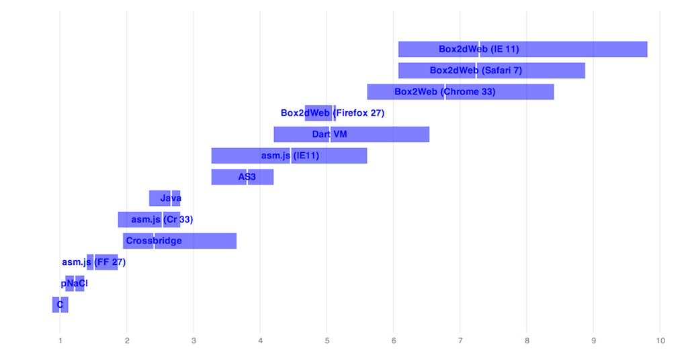

Just a quick post to call out a recent update to my old [Box2d benchmarks](https://github.com/joelgwebber/bench2d).
I'd been meaning to update the numbers for some time, and it became clear that now is that time when I got several
pull requests and issues reported within the last month or so (thanks to [Alon Zakai](https://github.com/kripken),
[Alex Russell](https://github.com/slightlyoff), [Kevin Moore](https://github.com/kevmoo), and
[Dan Gohman](https://github.com/sunfishcode) for that). Alex in particular sent me a cryptic message recently,
suggesting that I **absolutely** had to re-run the numbers, so here we are. It appears he was right!

## The Data

First, the updated numbers (these are on the project's README as well). If you look back at the ones from
[last July](https://github.com/joelgwebber/bench2d/blob/master/2013.07.05/results.md), you'll immediately notice
that just about every browser VM has improved dramatically.

|                           | ms/frame | 5th %ile | 95th %ile | Ratio to C |
|---------------------------|----------|----------|-----------|------------|
|C (clang-500.2.79)         | 2.14     | 1.89     | 2.41      | 1.00       |
|pNaCl                      | 2.61     | 2.31     | 2.92      | 1.22       |
|asm.js (Firefox 27)        | 3.24     | 3.00     | 4.00      | 1.51       |
|Flash/Crossbridge (\*)     | 5.16     | 4.16     | 7.81      | 2.41       |
|asm.js (Chrome 33)         | 5.43     | 4.00     | 6.00      | 2.54       |
|Java (1.8)                 | 5.71     | 5.00     | 6.00      | 2.67       |
|AS3                        | 8.15     | 7.00     | 9.00      | 3.81       |
|asm.js (IE11)              | 9.54     | 7.00     | 12.0      | 4.46       |
|Dart (Dartium)             | 10.8     | 9.00     | 14.0      | 5.05       |
|Box2dWeb (Firefox 27)      | 10.9     | 10.0     | 11.0      | 5.10       |
|Box2dWeb (Chrome 33)       | 14.5     | 12.0     | 18.0      | 6.78       |
|Box2dWeb (Safari 7)        | 15.5     | 13.0     | 19.0      | 7.24       |
|Box2dWeb (IE11)            | 15.6     | 13.0     | 21.0      | 7.29       |
|Dart2js (Chrome 33)        | 30.6     | 26.0     | 35.0      | 14.3       |
|asm.js (Safari 7) (\*\*)   | 272.     | 240.     | 309.      | 127.       |

[Test platform: MacBook Pro, 2.3 GHz i7, 16G memory, Mac OS X 10.9.2, Windows 7.
 All platform and compiler versions are latest unless otherwise specified.]

(*) Crossbridge is exhibiting some kind of problem calculating 5th %ile, so I
just set it to the mean - 1.

(**) asm.js performs so badly on Safari 7 that I left it off the graph to
avoid making it impossible to read.

  

  Scaled to multiples of native performance. The white line denotes the mean,
  and the edges of   the box denote the 5th and 95th %iles.

What you really notice at first is that all the performance multiples (everything on the graph is in terms of
multiples of native C) are compressed into roughly half the range from last year. Whereas in the past, the outliers
had 95th %iles in the 15-20x native range, now not a single one goes above 10x. This is huge for predictability if
you're shipping something that has to support all modern browsers.

Box2dWeb performance is now fairly stable across browsers, all running roughly 7x native, with significant but
acceptable variance. It's nice to see that with all the work going into pNaCl and asm.js, performance on idiomatic
Javascript is still improving and stabilizing.

We're also seeing significant improvement in Dart VM performance, from about 7x last year to 5x this year (and
notably outperforming all the Javascript VMs on idiomatic Javascript (though not asm.js output). And Dart2Js, while
unsurprisingly slower than hand-written Javascript, is closing in, now running within about 2x of raw Javascript
on V8.

pNaCl (which is in Chrome now, and the `p` part means no more nasty x86 binaries; it's all LLVM now!) remains right
around 20% slower than native, which is the same as it was for the old x86 NaCl. This makes me very happy, because
it felt incredibly odd to download a stinking pile of x86 code into my browser.

asm.js continues to pique my interest. While it's still a bit slower than pNaCl, it's running 1.5x native to pNaCl's
1.2x, which puts them both *very* close together at the head of the pack. And curiously, Chrome 33 now runs asm.js
output at only 2.5x native, which is a suspicously large improvement that makes me wonder if V8 has started specializing
on asm.js input, or just gotten *really* good at identifying those kinds of patterns (V8 people, feel free to comment
on this).

Last but not least, IE11 definitely wins in the "most improved" category. As much as we might like to bitch about
IE, v11 is trailing quite close to all the other browsers on both raw and asm.js input. This certainly leads me
to believe that Microsoft wasn't kidding when they said they were back in the browser business. Good on 'em!

## Takeaways

#### Everything's faster

As I noted above, **all** the VMs are faster than they were a year ago. Unsurprisingly, the slowest ones improved the
most, and this is great for predictability. If you need *decent* VM performance across browsers, you can rely on that
now. This has not been the case until recently.

#### The Dart VM's mostly faster than idiomatic JS

The Dart VM has clearly made large strides in the past year. If you're running *idiomatic* script code, it outperforms
most Javascript VM's (though Firefox is roughly the same, with lower variance). This is worth keeping an eye on, as I
suspect there are plenty more optimizations waiting in the wings.

#### "Native" code for high performance

At the same time, if you need every ounce of performance you can get, it's only becoming clearer that you need "native"
code. It's just that the definition of "native" is becoming fuzzier. The cluster of {C, pNaCl, asm.js} at the left
side of the graph are all *much* faster than any idiomatic script. Notably, all of these take C++ as input, not Javascript,
Dart, Java, or ActionScript. The routes they take to your CPU are varied, of course, but I think it's quite salient that
they all start with C++. This strongly implies that high-performance games on the web must either be written in C++,
or go through a toolchain like Unity or Unreal that can do this for you.

The case of asm.js output on Chrome 33 is an interesting one. It's improved dramatically, sitting in a little cluster
alongside Crossbridge and Java. If I'm correct in assuming that this improvement is entirely attributable to non-asm.js-specific
optimizations in V8, then it makes me wonder if it's feasible to get roughly equivalent performance to Firefox's
asm.js code generator without bifurcating the code generators. Interesting times!
