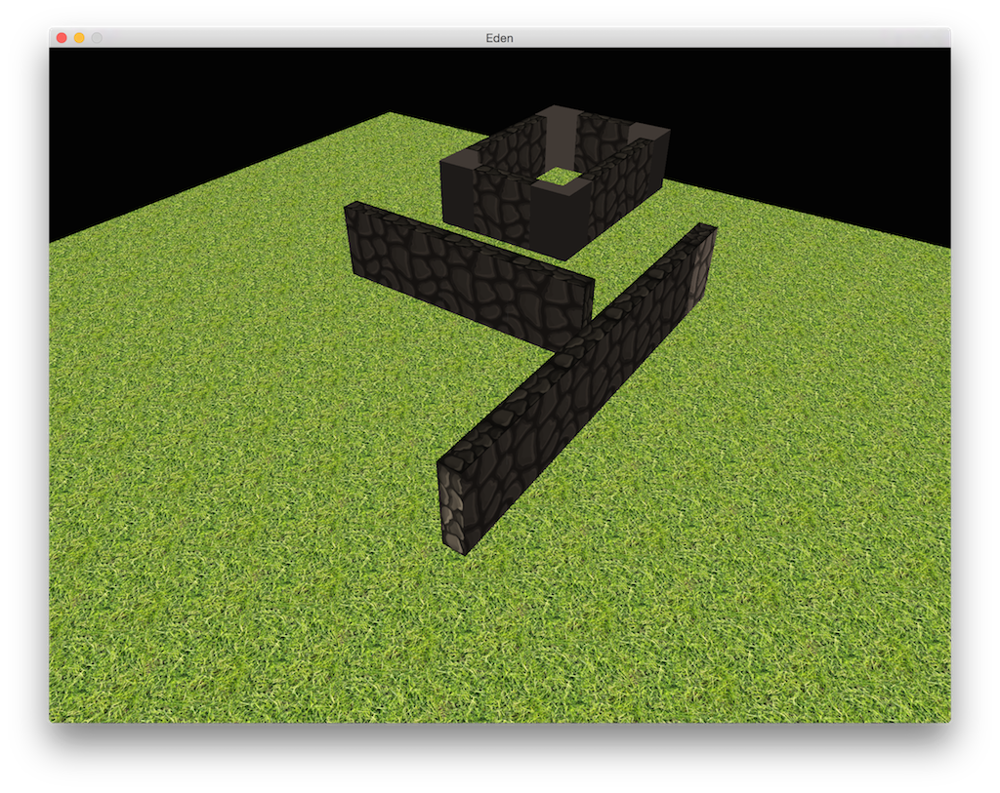
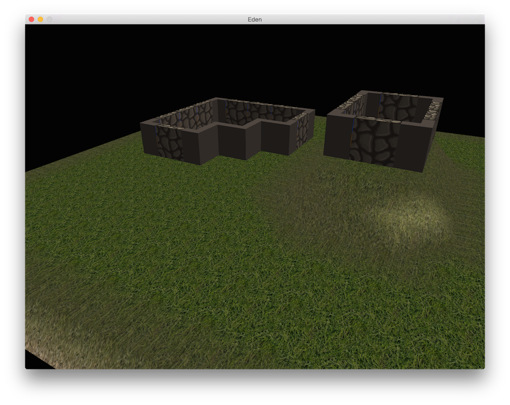

I haven't been a professional game developer in a very long time, but I do
still have a bit of nostalgia for it (the actual programming, not the
profession, which I'm glad to have left). Now that my daughter, at the tender
age of six, has developed a full-blown Minecraft obsession, I find that I'm
incined to create something that will allow us to experiment with more
interesting variations on that theme. I could, of course, just try modding
Minecraft, but (1) that doesn't sound like very much fun to me, (2) I like the
idea of easy creation, but I'd like something prettier, and (3) I'm looking for
an excuse to build something from scratch anyway!

But I have no desire to go back to writing C++. If I were building games
professionally, then of course that's what I'd do, but with this being a hobby
project I have a lot more leeway to experiment with different approaches. But
what should I use instead? I looked into a few different options (some of this
was originally discussed over
[here](https://plus.google.com/u/0/+JoelWebber/posts/PssyUNGEyn7):

- **Unity**: Love the tools (especially not having to muck about with importing
  meshes and animations). C# is ok, though MonoDevelop is slow and awkward, at
  least on my Mac. More importantly, C# performance can become a big issue if
  you try to do too much.
- **Go**: I love Go for server code at my day job, so why not? It has decent,
  nearly-zero-overhead GL bindings, good facilities for bit-banging, great
  concurrency primitives and networking, and fast compile times. And while it's
  GC'd, its memory model allows you to easily do clever things to avoid
  generating much garbage. But there's absolutely no functional debugger. I
  find this tolerable for server code, where you can mostly debug by looking at
  log messages between request/response, but for complex rendering algorithms
  and highly stateful client code it's a giant pain.
- **Rust**: I love the fact that it bends over backwards to be roughly zero
  overhead, and the approach to safety without garbage collection is clever. But
  damn, the memory management seems to get complicated quickly. And the
  debugging support is still close to non-functional, as with Go (I tried both
  gdb and lldb, and they both suffered from enough serious problems to render
  them useless).
- **Java**: Sure, Minecraft is written in Java, but I'd be hard-pressed to say
  that this has been to its benefit. The JVM, while great for servers, just
  isn't very well-suited to games. It starts slowly, consumes a lot of memory,
  and doesn't give you much of a chance to support non-desktop platforms (even
  on Android, the vast majority of games are C++/NDK).
- **Javascript** (well, Typescript or GWT at least): Being able to just bang out
  code and run it in the browser is nice. And both Typescript and Java have
  good tooling. But it's still way too slow. Some of the things I want
  to play with will be very much CPU bound, and a
  [5-8x slowdown](/blog/2014/05/23/Box2d_2014_Update) would be
  unacceptable (its performance is probably even worse on the kind of code I'm
  thinking of, where clever use of pointers and memory layout in C++ can make a
  big difference).

## Choosing Go

Despite the lack of a functional debugger, I decided to give Go a shot anyway.
I did actually try Rust for a bit, but discovered that I quickly got mired in
"type parameter hell". This may well be a result of my lack of practice with
the language, but I found it pretty off-putting, despite how much I like the
goals of the language and a lot of its design decisions.

I'm very comfortable with Go, because I write lots of it in my
[day job](https://www.fullstory.com/). Though it doesn't have a debugger
(the gdb support has been abandoned), there is at least the
[Delve](https://github.com/derekparker/delve/) project, which looks fairly
serious about doing it right (I guess I'll find out as soon as they get Mac OS
X [working](https://github.com/derekparker/delve/issues/3)). But there are
deeper reasons I think Go might be a reasonable alternative to C++.

Here is a partial list of things I would like from such an alternative:

- **Fast output**: It doesn't need to be precisely C speed, but it needs to
  be close. Go fits the bill here, and is improving with each release. And even
  though you might be led to assume otherwise looking at
  [some micro-benchmarks](http://benchmarksgame.alioth.debian.org/), I've found
  that in carefully-written hotspots it's quite competitive.
- **Easy to interface with C**: Interfacing with existing code doesn't have to
  be a trivial exercise, but the result needs to be low-overhead. Raw C is very
  easy to interface with Go. C++ (e.g., for
  [Bullet Physics](http://bulletphysics.org/) is trickier, but possible and
  efficient with tools like [SWIG](http://www.swig.org/). VM-based languages can
  add overhead at the transitions into native code, which can add up if you're not
  careful.
- **Control over memory layout**: This is important for cache coherency, among
  other things.  Games tend to create very large numbers of similar objects,
  and allocating them all individually on the heap is not the best idea.
- **Reasonably safe**: I don't really want to spend any more of my life chasing
  down dangling pointers, memory leaks, and double-frees. But I also don't want
  the solution to be a straight-jacket, or create massive inefficiencies.
- **Fast compiles**: I'm sick unto death of waiting on compilers. One of the
  reasons many games use embedded scripting engines is to get around this
  issue. There are others -- updating code in the running game, server-provided
  game logic, and so forth -- but slow C++ compilers tend to push developers to
  implement **too much** in script code.
- **Target platforms**: For the foreseeable future, I care about MacOS, Windows,
  Linux, Android, and iOS, in roughly that order. If I can't target these
  platforms (without any installation complexity), it doesn't matter how much
  I like the language.

It turns out that Go does quite well on these constraints. Many are obvious,
such as "reasonably safe" and "fast compiles", but there are some specific cases
on which I'd like to into more detail.

### Target platforms

Go actually falls slightly short on this front -- iOS support's still not quite
there yet. But for the desktop platforms and Android (NDK, which suffices),
it works out of the box. My understanding is that they're working on iOS support,
and I can afford to wait for it, so that shouldn't be a problem.

Just as importantly, the Go compiler produces a single statically-linked binary,
which is exactly what I want. There's a very small runtime, but apart from that
it gets out of your way, and doesn't put any unnecessary hurdles between you
and system calls. This suggests to me that it wouldn't be a massive undertaking
to support console platforms, because it's a question of toolchain rather than
a large runtime and/or VM.

### Memory layout and garbage collection

As you may be aware, Go's structs and pointers are very similar to C, with the
main difference being that pointer arithmetic is illegal. This means you can,
for example, implement a struct with a flat memory layout, like so:

    type Mat4 [16]float32

    type Entity struct {
      Id        uint32
      Transform Mat4
      Mesh      *gfx.Mesh
    }

In the above example, an Entity will occupy precisely `4 (uint32) + 64 (16
float32s) + 8 (64-bit pointer)` bytes on a 64-bit platform. If you allocate a
bunch of these in an array or slice, they'll be in one contiguous block on
the heap. This gives you a lot of control over memory layout.

Also, as in C, you can safely take pointers to the middle of structs and
arrays.  This is an underappreciated property of Go that unlocks a lot of
useful tricks and optimizations. So, for example, it's perfectly idiomatic to
write code like this:

    // Sets the elements of the [16]float to a 4x4 identity matrix.
    // NOTE: I would more likely make this a method on Mat4.
    func Ident(m *Mat4) { /* ... */ }

    var ent Entity
    Ident(&ent.Transform)

You can do the same thing with a bunch of structs allocated together in
an array/slice:

    // Function that does something mutative to an entity, and can also
    // hold on to the pointer if it likes.
    func DoSomethingTo(ent *Entity) { ... }

    var lotsOfEnts = make([]Entity, 64)
    DoSomethingTo(&lotsOfEnts[32])

What's so cool about this? Well, in addition to cache coherence, you can
also use it to roll your own pool allocators. This is very useful when you
have to allocate lots of identical structs, and don't want to generate a
lot of garbage -- the above example makes only one heap allocation!

Game developers are legendary for their fear of garbage collection, and often
for good reason. When you have approximately 16ms (1s / 60fps) to do all the
work between two frames, GC pauses can be a nightmare. Having the ability to
dramatically reduce the amount of garbage you generate, without losing memory
safety, changes everything.
[This article](https://blog.cloudflare.com/recycling-memory-buffers-in-go/)
gives a good example of how this can play out in practice.

### Interfacing with native code

Go makes interfacing with C interfaces trivial. It also offers some useful tricks
for improving the semantics of some libraries, without introducing any overhead.
I'm using [go-gl](https://github.com/go-gl/gl) to interface with OpenGL, and it's
very straightforward. But they've added nice little touches like this that
reduce the rate at which I screw things up:

    // From go-gl:
    type Object C.GLuint
    type VertexArray Object

    func GenVertexArray() VertexArray { /* ... */ }
    func (array VertexArray) Bind() { /* ... */ }

    // My code:
    va := gl.GenVertexArray()
    va.Bind()

    // What it looks like in C:
    GLuint vao = glGenVertexArray();
    glBindVertexArray(vao);

This is a small touch, but it really helps avoid many of the errors that stem
from forgetting what the types of GL's myriad "handles" are. But the real
beauty is that I'm not paying anything for this functionality. `gl.VertexArray`
isn't a "wrapper object" like it would be in many other languages, and
disappears at runtime.

### Unsafe at high speeds

That's all cool, but where I find a lot of higher-level languages really fall
down for game development is in some of the low-level tricks we use that play
fast-and-loose with memory. A common case is resource loading, which when
implemented inefficiently is the bane of many a gamer. Imagine, for example,
a simple `MeshDef` type, which represents the vertices and indices for a triangle
mesh, and needs to be loaded quickly from disk:

    type MeshDef struct {
      // (Some stuff like materials and vertex layout info elided for clarity)
      verts:   []float32,
      indices: []uint16,
    }

Now you could just implement this by reading the verts and indices from a stream,
fixing up endianness for the uint16s as you go. But if you're an old-school
game developer, that idea probably makes you pretty uncomfortable. These things
can easily have on the order of 10^5 or 10^6 elements, so that's a **lot** of
work, especially across many objects.

In C, you could simply map the resource file into memory with `mmap()` or
`CreateFileMapping()`, then fill in the vert/index array pointers in the struct
to point directly at the mapped file. Sure, you'd have to have different
resource files for little/big-endian systems, but the performance benefit
often makes that a worthwhile tradeoff. Especially when you consider that
desktops, Android, iOS, PS4, and the XBox One are all little-endian.

Go doesn't provide a "safe" way to do this. But it's still possible
without much trouble. [mmap-go](https://github.com/edsrzf/mmap-go) provides a
nice cross-platform `mmap()` abstraction that solves half the problem. Then
you just need to figure out how to turn a `[]byte` into, say, a `[]float32`.
Something like this:

    // Map the resource file.
    mmap, _ := gommap.Map(f.Fd(), gommap.PROT_READ, gommap.MapFlags(0))

    // Get the size/offsets of the vert/index arrays from somewhere.
    var vertCount, idxCount int
    var vertOffset, idxOffset int

    // Grab them with foul, unsafe magic.
    mesh.verts := foul.SliceFloat32(mmap[vertOffset:vertCount*4])
    mesh.indices := foul.SliceUint16(mmap[idxOffset:idxCount*2])

But how does the `foul` package work? Like so:

    func SliceFloat32(b []byte) []float32 {
      count := len(b) / 4  // 4 bytes per float
      slice := reflect.SliceHeader{uintptr(unsafe.Pointer(&b[0])), count, count}
      return reflect.NewAt(float32SliceType, unsafe.Pointer(&slice)).Elem().Interface().([]float32)
    }

Gross? Hell, yes. Fast? Most definitely (I realize the reflection code looks
complex, but it actually does very little work at runtime). The important thing
is that it's **possible**, and that you can hide the nasty bits in a way that
the rest of your code is unlikely to screw up. There are some caveats here, of
course.  You have to be careful, because the GC doesn't know anything about your
shenanigans. But it's still a lot safer than doing it all in C++, and roughly as
fast.

## Caveats

This is an experiment so I'm using Go and if you like writing games (or anything
else, for that matter) in C++, then by all means continue to do so. But there are
plenty of people who are frustrated with C++ for games (witness Jonathan Blow
running off and creating his [own](https://www.youtube.com/user/jblow888)
alternative, even while he's in the middle of another
[big project](http://the-witness.net/) in C++). So I think it's a worthwhile
pursuit to look into alternatives, regardless of whether Go turns out to be
viable for professional games.

## Progress

So what am I actually building? The short answer is that I'm not entirely sure.
At the moment it's just a testbed for my hypothesis that you can make something
that allows the straightforward creativity of Minecraft (recall my daughter's
obsession), but with a great deal more flexibility, and that looks a lot better.
We'll see if that's achievable, and if so what it morphs into as we design it
together.

Here are a few early screenshots. The rough model is a simple voxel engine,
where each cell has a type and density. The type is used to pick a mesh and
orientation in a way that's sensitive to its surrounding cells' contents (so
that, e.g., walls, windows, and floors merge together nicely). The density
is used for terrain cells, which feeds into a marching cubes mesh renderer
that produces a single, more organic and efficient mesh for each world
chunk.

Please forgive the horrifyingly-bad programmer art (and my near complete
inability to operate Blender sensibly). The point is mainly to prove out
my intuitions about how such structures can be built.

The first is a very simple renderer that maps each cell in a voxel space to a
single mesh.

This one, a bit farther along, still uses the voxel->mesh mapping, but also
uses marching-cubes to build the terrain mesh.

There's no code available yet, because it requires a lot of care and feeding.
I'll push the repo to Github once it's far enough along to be interesting. I'll
also hoist out some of the more useful and separable bits into their own
libraries at some point. Stay tuned, and I'll follow up with more updates and
working code. I'm also working on other parts of the engine for which I believe
Go is uniquely well-suited (especially around concurrency and networking),
and I'll be posting more about how well that goes.

